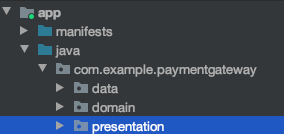
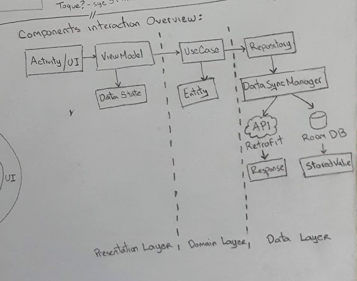
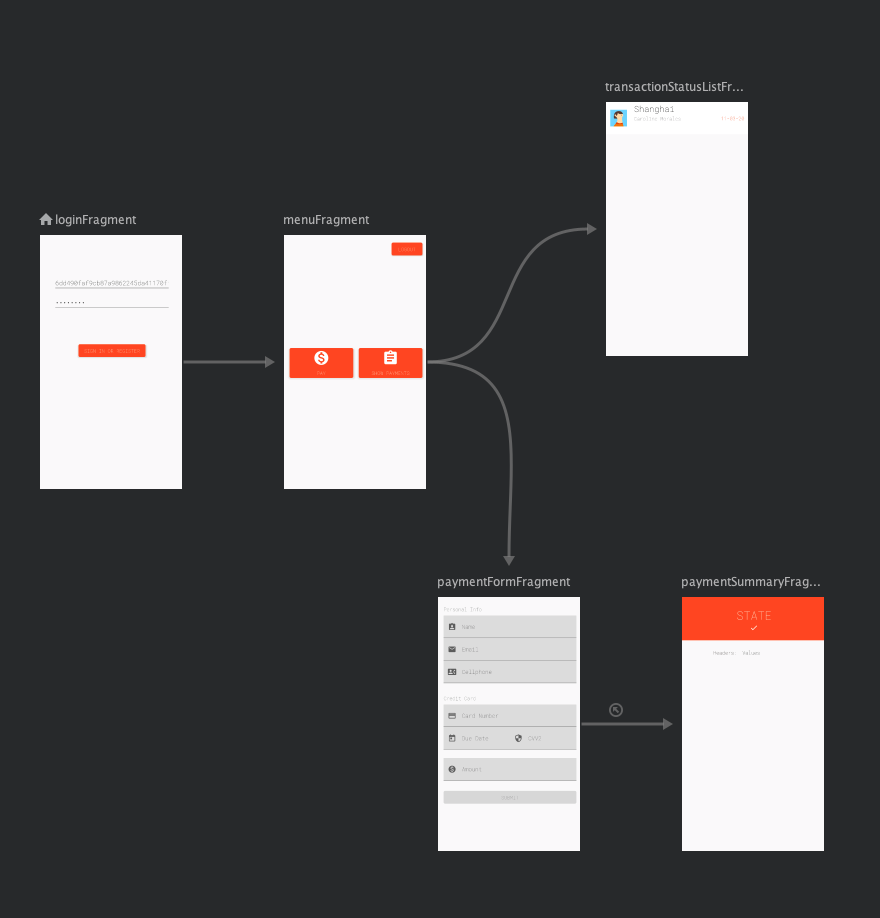
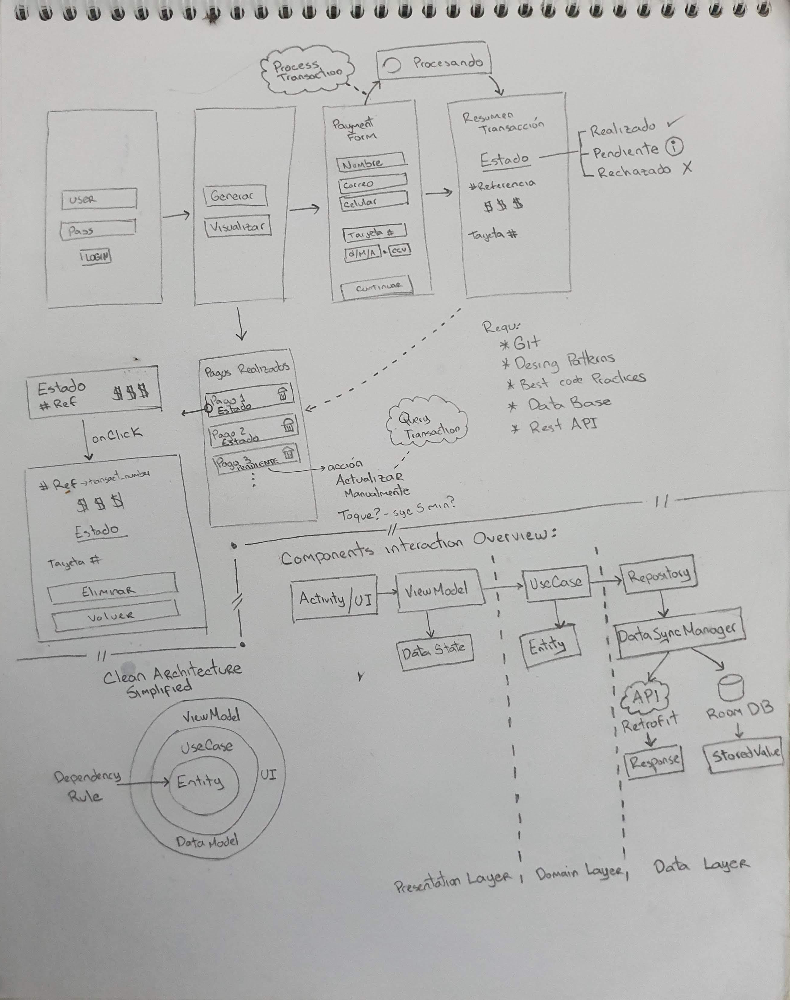

PAYMENT GATEWAY - AN ANDROID APP USE CASE
===============

About this repo
---------------

This was an interview project where I gave all my effort to develop a clean code base through a maintainable and scalable architecture.

ABOUT THE PROBLEM STATEMENT
---------------------------

As a final user, you download an app where you can generate payments for different products with values of an X store. To generate the payment you have to provide the following data to the app:
- name
- address
- email
- cellphone number

Additionally, taking into account that the payment method will always be of credit card type, you must provide the card number, the due date, and the security code (CVV).

After the checkout, you should be able to see a summary of the payment transaction info. You also have an option to see all the payments that have been doing through the app, showing the relevant information like the checkout reference, amount, credit card info, and the checkout status. The user should be able to remove any selected checkout from the list.

### Important info
- The app uses the Placetopay dev API to process the transactions through a REST API. 
- After sending the checkout through the RES API, the service will return a current transaction status. In this way the checkout may fall in one of the following states:
    - Approved
    - Pending
    - Failed
    - Rejected

### __FIRST__ Let's break down the given information:

We need to create an app with the following screens (requirements of the client):
1. A login screen to provide the user/pass (These credentials are required to make a request to the REST API)
2. A main menu with two options: one to generate the payments and another to see the historical list of checkouts.
3. A form screen to garnering the required info to make the checkout.
4. A summary screen to show the checkout processing result
5. A list view that shows the information of the latest checkouts with the option to delete them.

### Nice to have

When a transaction is in **PENDING** state, the user will be able to request an update for that checkout at any time.

You can use the following fake credit cards number to test this:
- 400558 00 00 00 0040 -> Should return Rejected status
- 007000 00 00 27 -> Should make an Approved checkout
- 411111 11 11 11 1111 -> Approved
- 421212 12 12 12 1214 -> Approved
- 421544 00 00 00 0001 -> Rejected

HANDS TO WORK!
==============

The Solution approach
---------------------

Applying all the knowledge I have been acquiring so far to become to be a Software Architect, I decided to create a codebase using the Clean Architecture approach as follows.

Architecture definition
-----------------------

The main idea being defining an architecture to start coding is to divide the software system into small logical pieces of work, aka divide and conquer principle.

Taking the Clean Architecture defined by Robert C Martin as the start point, I have created a simplified version of it for this project. This architecture tackles a Domain Driven Development (DDD) approach, dividing the system into 3 different layers (remember this is a simplified version of CA):

Those are the 3 different packages that you will find in the source code.

Components interaction diagram
-------------------------------

Brief description of the layers:
===============================

### PRESENTATION LAYER
It contains all the components regarding the UI/Android interfaces.

**Bullet points:**
- MVVM pattern is used with the help of JetPack's ViewModel library.
- Navigation component is used to simplify the navigation flow management.
- Material Design theme definition as the basis of the overall app style.

### DOMAIN LAYER
The core architecture layer. It defines the client requirements and sets a code that is clean and concise enough to guarantee the maintainability, flexibility, and scalability of the system.

**Bullet points:**
- High test coverage: Although this project doesn't have tests (I promise to add them when having some room), this layer gives us a base code free of external dependencies, with enough clarity, that follows the Single Responsibility principle, making this a layer of code easy to test and maintain. I need to highlight the need for implementing tests for all the layers of code inside the app, but due to the third-party dependencies, they would be harder to implement for the rest of the layers.
- Inversion of Control principle IoC: The use cases do its work through the repository interfaces, and any other dependency that the use case would need, are used with interfaces. Have a dependency from abstractions instead of an implementation is the basis of the low in coupling code and high in cohesion.

### DATA LAYER
Implementing the Repository pattern defines the local database managed by Room as the Single Source of Truth. This custom implementation uses a synchronization policy defined at the _NetworkBoundResource_ class. This class makes a data synchronization between the remote source and the database, based on a condition defined in each one of the repositories.

**Bullet points:**
- At the transaction list screen, each time the user gets into this view fragment, the _PENDING_ transactions are synchronized with the cloud.
- A unique LiveData object is returned to the view after merging the data requests from the repositories, in this way the user is always seeing the latest data without matters about the source of truth.

### Other libraries and characteristics to be highlighted
- **Kotlin Coroutines**: To make the async requests like networking and database.
- **Live Data**: used as the main mechanism of inter-components communication. Sending the received data from the cloud to the database, to the use case, to the UI to be finally shown to the user.
- **Mappers**: Each layer boundary needs to use a mapper to converts between the different models used by the layering architecture. These classes could be identified in the file explorer by looking at the end of the file name:  "...Mapper.kt"
- Kotlin-Extensions-Functions, ViewBinding, Regex and among other features: You will find a lot of technologies used in this project, feel free to inspect each part, I did my best effort to have a clean and easy to understand code (with a minimum knowledge of course). I'm open to improvements and questions.
- Third-party code: There are a couple of classes that I use as start point for coding, taken from the Google samples repositories. Copying good code is not a bad practice, not recognize the original author, it is. Thanks Google, for giving me the base code to create the NetworkBoundResource.kt and ApiResponse.kt classes.

